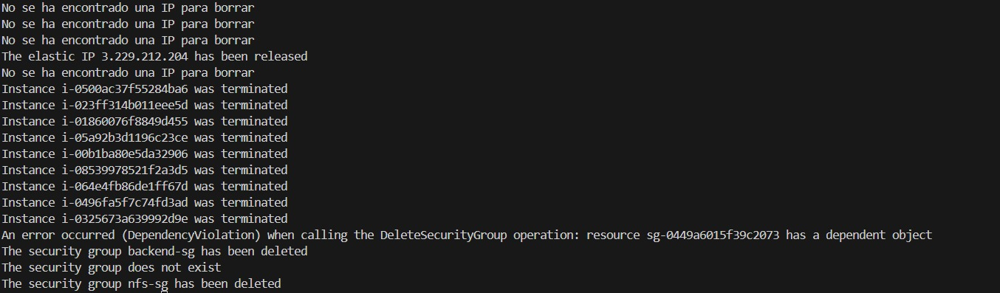

# Practica4.3
IAW 2º ASIR
# Ejercicio1
```python
from common import aws_resource_functions as aws

# Hacer las reglas de entrada del grupo de seguridad
ingress_permissions = [
    {'CidrIp': '0.0.0.0/0', 'IpProtocol': 'tcp', 'FromPort': 22, 'ToPort': 22},
    {'CidrIp': '0.0.0.0/0', 'IpProtocol': 'tcp', 'FromPort': 3306, 'ToPort': 3306}
]

# Definir el nombre y la descripción del grupo de seguridad
sg_name = 'backend-sg'
sg_description = 'SG para el backend'

# Crear el grupo de seguridad
aws.create_security_group(sg_name, sg_description, ingress_permissions)

# Listar los grupos de seguridad
aws.list_security_groups()
```

```python
from common import aws_resource_functions as aws

# AMI ID
ami = 'ami-08e637cea2f053dfa'

# Instance type
instance_type = 't2.micro'

# SSH key name
key_name = 'vockey'

# Instance name and security group name
instance_name = 'backend'
sg_name = 'backend-sg'

# Verificar si el grupo de seguridad existe
if aws.security_group_exists(sg_name) == False:
    print('El grupo de seguridad no existe')
    exit()

# Crear la instancia
aws.create_instance(ami, 1, instance_type, key_name, instance_name, sg_name)

# Listar las instancias
aws.list_instances()
```
# Ejercicio2

# Ejercicio3

# Ejercicio4

